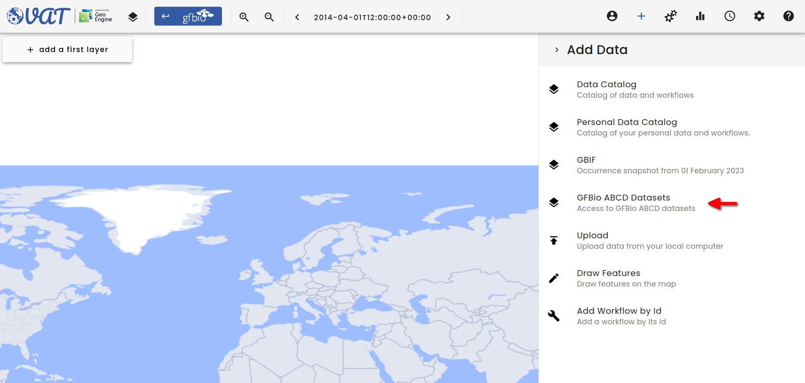
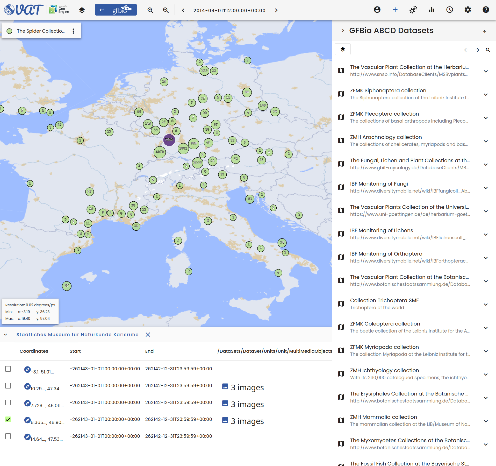
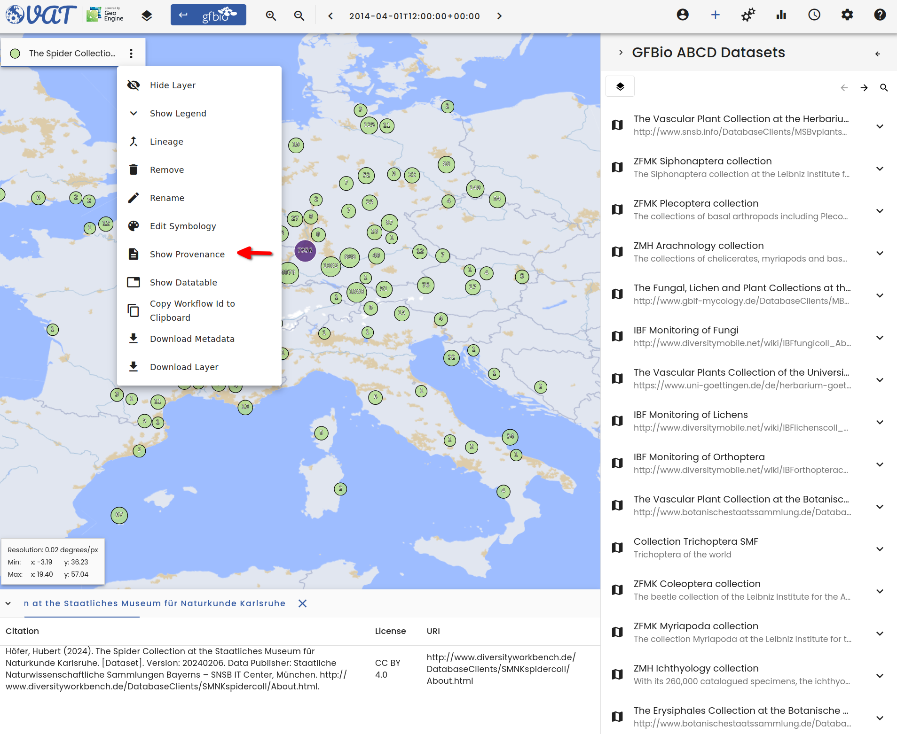

# ABCD Archive Connection

GFBio's connected [Data Centers](https://kb.gfbio.org/display/KB/Data+Centers) provide access to a variety of data archives.
The VAT system allows users to access these archives directly.
This makes it easier to access data without having to download it themselves.
In addition, users can map the data together with other data sources in the VAT system.

In the background, the VAT system harvests all ABCD data from the GFBio Search Index every night.
Thus, updates to the ABCD data are available in the VAT system the next day.

## Finding the archives

To find the ABCD data, users can click on the `+` button in the data menu.
This opens a dialog where users can select the _GFBio ABCD Datasets_ menu item.
This will show all ABCD datasets that are available in the VAT system.

## Selecting data

Users can select the data they are interested in by clicking on the dataset.
This will load all occurrences from the selected dataset into the VAT system as a new layer.

The data is displayed on the map as clustered points and can then be used like any other data in the VAT system.
Zooming in will dissolve the clusters and show the individual occurrences.
Users can also open the data table to see more attributes of the occurrences.

## Multimedia items

Some ABCD datasets contain linkts to multimedia items.
These can be images, videos, or audio files.
Users can click on the multimedia item in the data table to open it in a new dialog.
For instance, when the item is an image, it will be displayed directly in the VAT system.

The data table will show at most 3 links for clustered occurrences.
As a users, you can zoom in to see more items.

## Citing the data

To cite the data, users can click on the _Show Provenance_ icon in the context menu.
This will open a table that shows the citation for the data.

The table has three columns: _Citation_, _License_, and _URI_.
The _Citation_ column contains the citation for the data.
The _License_ column contains the license under which the data is available.
The _URI_ column contains the URI to the license file.
